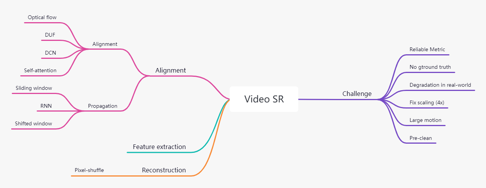
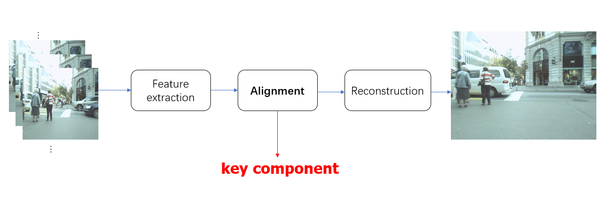
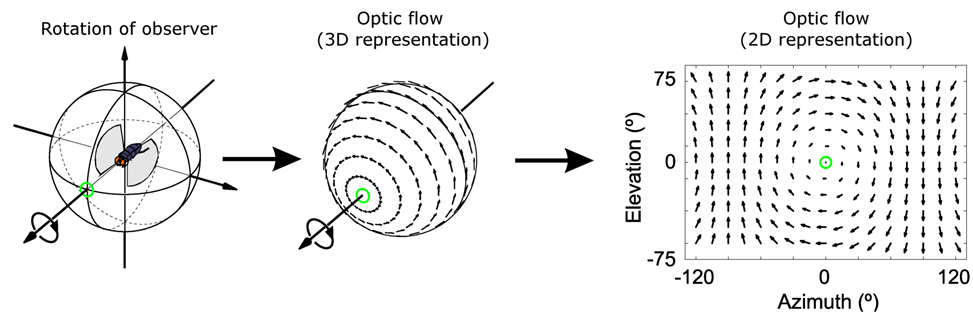

# Note for Video Super Resolution

## Method Comparison

Model|year|Alignment|Propagation|Params(M)|Runtime(ms)|REDS4(PSNR)
-|-|-|-|-|-|-|
ToFlow|2017|Optical Flow|-|-|27.98|-|
[DUF](paper.md#duf)|2018|Dynamic Upsampling Filters|Sliding window|5.8|974|28.63|
[TDAN](paper.md#tdan)|2018|DCN(V1)|Sliding window|-|-|-|
[EDVR](paper.md#edvr)|2020|DCN(V2) + Temporal and Spatial Attention|Sliding window|20.6|378|31.09|
BasicVSR|2021|Optical flow|Bi-RNN|6.3|63|31.42|
BasicVSR++|2021|Optical flow + DCN|Second-order grid propagation|7.3|77|32.39|
[VRT](paper.md#VRT)|2022|Optical flow + Self-attention|Shifted window|35.6|243|32.19|

(Ref:experiment result from [VRT](paper.md#VRT))

****

- [Note for Video Super Resolution](#note-for-video-super-resolution)
  - [Method Comparison](#method-comparison)
  - [Outline](#outline)
  - [Video super resolution](#video-super-resolution)
  - [Alignment](#alignment)
    - [alignment](#alignment-1)
      - [1. Optical flow](#1-optical-flow)
      - [2. Dynamic Upsampling Filters](#2-dynamic-upsampling-filters)
      - [3. Deformable Convolution Network](#3-deformable-convolution-network)
      - [4. Self-attention](#4-self-attention)
    - [propagation](#propagation)
      - [1. Sliding window](#1-sliding-window)
      - [2. RNN](#2-rnn)
      - [3. Shifted window](#3-shifted-window)
  - [Challenge and Solution](#challenge-and-solution)
    - [Reliable Metric](#reliable-metric)
    - [Data-free](#data-free)
    - [Degradation in real-world](#degradation-in-real-world)
    - [Fix scaling (4x)](#fix-scaling-4x)
    - [Large motion](#large-motion)
    - [Prior](#prior)

## Outline

****

## Video super resolution

****

## Alignment

### alignment
#### 1. Optical flow
- Traditional optical flow
  - **Two constraints**: 
    - 1. Brightness constancy constraint 
    - 2. Only small movement
  
  - **Solution**:
    - Deep learning model
      - has no constraints
      - learn more spatiotemporal information
- Deep learning in optical flow 
  - Ref: Optical Flow Estimation using a Spatial Pyramid Network,2016

  - **Problem**
    - Real-world data: large motion, blur, noise… 
    - Performance not good enough
  - **Soultions**
    - As auxiliary information(Better)
      - BasicVSR++,[VRT](paper.md#VRT) 
    - Replaced by deep models
      - [DUF](paper.md#duf),[TDAN](paper.md#tdan),[EDVR](paper.md#edvr)

#### 2. Dynamic Upsampling Filters
#### 3. Deformable Convolution Network
#### 4. Self-attention

### propagation
#### 1. Sliding window
#### 2. RNN
#### 3. Shifted window

****

## Challenge and Solution
### Reliable Metric
### Data-free
### Degradation in real-world
### Fix scaling (4x)
### Large motion
### Prior
