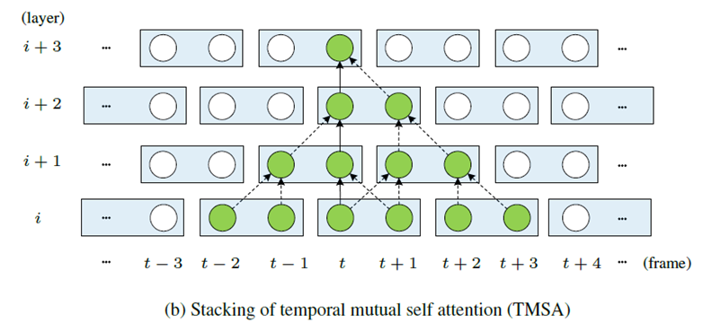

# Note for Video Super Resolution

## Method Comparison

Model|year|Alignment|Propagation|Params(M)|Runtime(ms)|REDS4(PSNR)
-|-|-|-|-|-|-|
ToFlow|2017|Optical Flow|-|-|27.98|-|
[DUF](paper.md#duf)|2018|Dynamic Upsampling Filters|Sliding window|5.8|974|28.63|
[TDAN](paper.md#tdan)|2018|DCN(V1)|Sliding window|-|-|-|
[EDVR](paper.md#edvr)|2020|DCN(V2) + Temporal and Spatial Attention|Sliding window|20.6|378|31.09|
BasicVSR|2021|Optical flow|Bi-RNN|6.3|63|31.42|
BasicVSR++|2021|Optical flow + DCN|Second-order grid propagation|7.3|77|32.39|
[VRT](paper.md#VRT)|2022|Optical flow + Self-attention|Shifted window|35.6|243|32.19|

(Ref:experiment result from [VRT](paper.md#VRT))

****

- [Note for Video Super Resolution](#note-for-video-super-resolution)
  - [Method Comparison](#method-comparison)
  - [Outline](#outline)
  - [Video super resolution](#video-super-resolution)
  - [Alignment](#alignment)
    - [alignment](#alignment-1)
      - [1. Optical flow](#1-optical-flow)
      - [2. Dynamic Upsampling Filters](#2-dynamic-upsampling-filters)
      - [3. Deformable Convolution Network](#3-deformable-convolution-network)
      - [4. Self-attention](#4-self-attention)
    - [propagation](#propagation)
      - [1. Sliding window](#1-sliding-window)
      - [2. RNN](#2-rnn)
      - [3. Shifted window (VRT)](#3-shifted-window-vrt)
  - [Challenge and Solution](#challenge-and-solution)
    - [Reliable Metric](#reliable-metric)
    - [Data-free](#data-free)
    - [Degradation in real-world](#degradation-in-real-world)
    - [Fix scaling (4x)](#fix-scaling-4x)
    - [Large motion](#large-motion)
      - [Problem](#problem)
      - [Solution](#solution)
    - [Prior](#prior)

## Outline

****

## Video super resolution

****

## Alignment

### alignment
#### 1. Optical flow
- Traditional optical flow
  - **Two constraints**: 
    - 1. Brightness constancy constraint 
    - 2. Only small movement
  
  

  - **Solution**:
    - Deep learning model
      - has no constraints
      - learn more spatiotemporal information
- Deep learning in optical flow 
  - Ref: Optical Flow Estimation using a Spatial Pyramid Network,2016

  - **Problem**
    - Real-world data: large motion, blur, noise… 
    - Performance not good enough
  - **Soultions**
    - As auxiliary information(Better)
      - BasicVSR++,[VRT](paper.md#VRT) 
    - Replaced by deep models
      - [DUF](paper.md#duf),[TDAN](paper.md#tdan),[EDVR](paper.md#edvr)

#### 2. Dynamic Upsampling Filters
  - [Deep Video Super-Resolution Network Using Dynamic Upsampling Filters Without Explicit Motion Compensation](paper.md#deep-video-super-resolution-network-using-dynamic-upsampling-filters-without-explicit-motion-compensation)
#### 3. Deformable Convolution Network
  - **Problem**:Training instability
  - **Soultion**:
    - Pyramid [(EDVR)](paper.md#edvr)
    - Add other information to guide(optical flow) (BasicVSR++)
#### 4. Self-attention
  - Temporal mutual self attention (Multi-scale in feature extraction) [(VRT)](paper.md#VRT)
    - **Advantages:** can deal with large motions ()
    - **Problem:** Heavy Computational load and heavy model

### propagation
#### 1. Sliding window
- Most commonly used in the past paper.
- **Problem**: 
  - Only adjacent frames’ information
  - Can’t learn Long-term motion patterns

#### 2. RNN
- **Problem**: (BasicVSR,BasicVSR++)
  - Recurrent models are not good at long-range temporal dependency modelling
  - Limit in distributed training

#### 3. Shifted window ([VRT](paper.md/#VRT))
- **Aim**: Solve the problem in RNN
- **Problem**: 
  - Computational load increase and model becomes heavy.
  - Limit by the computation, the model can only stack several layers.

****

## Challenge and Solution
### Reliable Metric
- ref: The Unreasonable Effectiveness of Deep Features as a Perceptual Metric,2018 CVPR.
- **Problem**: 
  - PSNR,SSIM does not correspond well to human perception about image
  - Cannot evaluate the model gap well. 
- **Solution**:
  - Focus on Perceptual Similarity (LPIPS in CVPR 2018)
  - New metric: Consider Perceptual Similarity, motion in adjacent frames…

### Data-free
- Self-supervised learning
  - Learn SR from far to close in image

- Unsupervised learning
  - Learn SR from other datasets

### Degradation in real-world
- Traditional Downscaling methods:  Bicubic-down, Blur-down 
  - Problem: Unknown Degradation in real-world 
- **Solution**:
  - Simulate diverse degradations
    - More complex method to do downscaling: temporally-varying degradations/Stochastic degradation 
      - ref: Investigating Tradeoffs in Real-World Video Super-Resolution,2022 CVPR.
    - New degradation methods(?)

  - Learn the degradation kernel in target data
  - In image super-resolution: (ref: Unsupervised Real-World Super-Resolution: A Domain Adaptation Perspective,2021 ICCV.)
    - Degradation-indistinguishable feature
    - Degradation style feature
  - **Video SR:**
    - Degradation-indistinguishable feature
    - Degradation style feature
      - static degradation (Invariant between frames)
      - dynamic degradation (Variant)

### Fix scaling (4x)
- Any scale (Upsampling 4X only now)

### Large motion
#### Problem
- conventional methods easily bring incoherent results or artifacts. 
- optical flow estimation is only accurate in scenes with small motion. 
  - (ref: Image Super-Resolution with Non-Local Sparse Attention)
#### Solution
- Whether attention can solve this problem?
- U-shaped residual dense network with 3D convolution
  - (ref: Large Motion Video Super-Resolution with Dual Subnet and Multi-Stage Communicated Upsampling, 2021 AAAI)

### Prior
- Deblurring
- Denoise
- Cleaning module (stack of residual blocks)
  - (ref: Investigating Tradeoffs in Real-World Video Super-Resolution, 2022 CVPR.)
