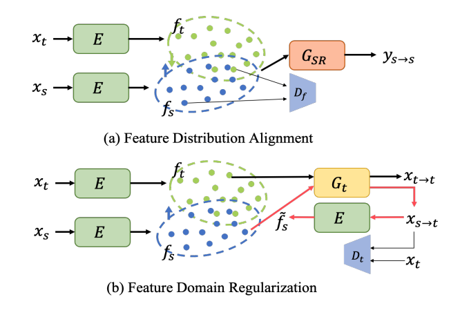
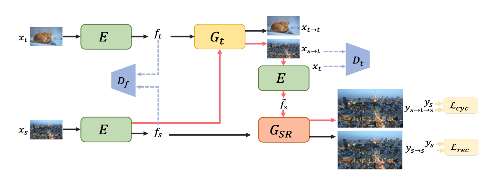
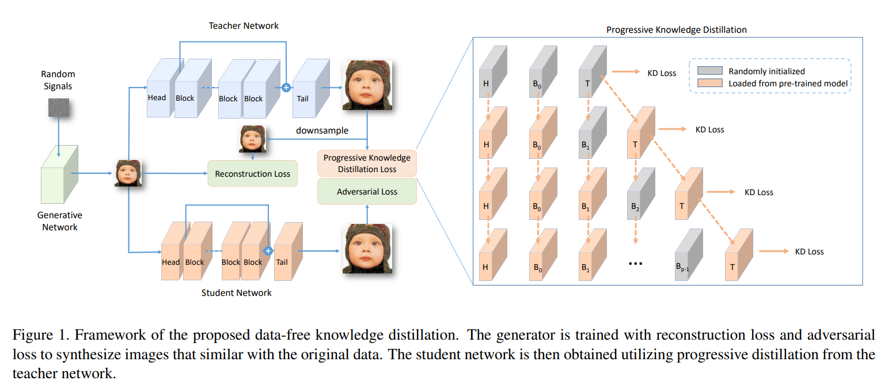
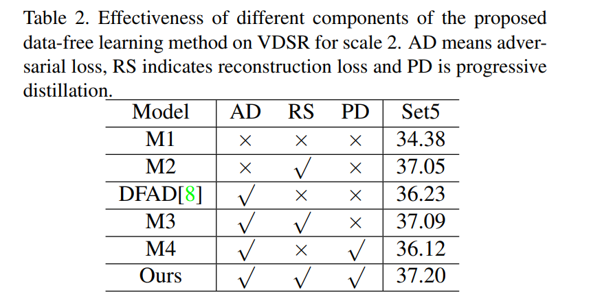

# Video Super Resolution

paper|year|conference|keyword|link
-|-|-|-|-
Deep Video Super-Resolution Network Using Dynamic Upsampling Filters Without Explicit Motion Compensation|2018|CVPR|Dynamic filter network, No optical flow
TDAN: Temporally Deformable Alignment Network for Video Super-Resolution|2018|CVPR|DCN(V1)
|Investigating Tradeoffs in Real-World Video Super-Resolution|2022|CVPR|Based on BasicVSR++|[paper](https://arxiv.org/pdf/2111.12704.pdf)  [code](https://github.com/ckkelvinchan/RealBasicVSR)|
[Data-Free Knowledge Distillation For Image Super-Resolution](#data-free-knowledge-distillation-for-image-super-resolution)|2021|CVPR|data-free model compression,ISR|[paper](https://openaccess.thecvf.com/content/CVPR2021/papers/Zhang_Data-Free_Knowledge_Distillation_for_Image_Super-Resolution_CVPR_2021_paper.pdf)  [code](https://github.com/twtygqyy/pytorch-vdsr)
[Unsupervised Real-World Super-Resolution: A Domain Adaptation Perspective](#unsupervised-real-world-super-resolution-a-domain-adaptation-perspective)|2021|ICCV|unsupervised domain adaptation,degradation-indistinguishable feature,ISR|[paper](https://openaccess.thecvf.com/content/ICCV2021/papers/Wang_Unsupervised_Real-World_Super-Resolution_A_Domain_Adaptation_Perspective_ICCV_2021_paper.pdf)  [code](https://github.com/anse3832/USR_DA)

****
## Unsupervised Real-World Super-Resolution: A Domain Adaptation Perspective
### Main idea
**Background**: Most methods in SR try to generate the low-resolution(LR) data from the high-resolution (HR) dataset to train their model. But the **degradation in the real world** is hard to predict. So they try to find the  **degradation-indistinguishable feature**.

**Method**: They use the unsupervised domain adaptation to avoid this problem. The dataset they used is the **unpaired real LR and real HR**, but no degradation prior. They decompose this task into **degradation-indistinguishable feature and degradation style**
1. **Feature Distribution Alignment** (figure a)
     - **learn degradation-indistinguishable feature**: they align the feature distribution of source and target LR data.
       - Encoder $E$: generate source and target feature($f_t$,$f_s$) map to fool the discriminator.
       - discriminator $D_f$:distinguish the domain of features
       - $G_{SR}$(Decoder): Reconstruct the source LR images into HR images.
2. **Feature Domain Regularization** 
   - **learn the degradation style in target domain** (figure b): 
     -  Target LR restoration loss (Black flow): Use the $G_t$ to restore the target LR image from target feature($x_{t\rightarrow t}$). Aim to **keep the shared feature space closer to target domain** .
     -  Target degradation style loss(Red flow): Use the $G_t$ to generate the source LR image from target feature($x_{s\rightarrow t}$). And then reuse the Encoder to train. Aim to **learn the degradation style of the target domain**
     -  Feature identity loss(Black thin flow): Use discriminator $D_t$ to **keep the degradation style of the target domain**.
   -  Reuse the $G_{SR}$ to generate the HR image of source data in target degradation style $y_{s\rightarrow t \rightarrow s}$. And then use $y_{s\rightarrow s}$ and $y_{s\rightarrow t \rightarrow s}$ to **train the HR reconstruction model in target degradation style** (right figure)

**Experiment result**: SOTA in blind/unsupervised methods on unpaired dataset. LPIPS performance is better than bicubic downsampling and Mixed degradation methods.

### Highlight
1. Decompose the SR task into degradation-indistinguishable feature and degradation domain feature.
2. Metric: LPIPS

### Idea
1. Consider transfering this method to VSR. But the degradation style will always change in video. So this method can not be directly use.
2. How the model train. Read the code.

****
## Data-Free Knowledge Distillation For Image Super-Resolution
### Main idea
**Background**: privacy and transmission limitations

**Method**: Use the data-free compression approach in SISR. 
1. **Design a reconstruction loss for the SISR model.** Because the inputs and outputs of SR model should be in **similar distribution**. So they develop a new reconstruction loss in using this relation.
2. **Progressive Knowledge Distillation.** This mechanism will train a tiny network at first. Then they increase the number of layers and blocks gradually and train those new layers and blocks. In this way, the network can be trained easier and distill more information on intermediate features in teacher network.
   
**Experiment result**: they choose VDSR as the teacher model. The student model can achieve similar performance with the teacher model.

### Highlight
1. Use the progressive distillation to solve the training difficulty of the deep network.
### Problem
1. the improvement of the progressive distillation is not significant. and they only do the ablation experiment in one dataset.
2. They did not compare the training time and parameters to show the compression.

### Idea
1. In Data-Free Knowledge Distillation about VSR, we can also use the similar idea like the reconstruction loss in this paper. The inputs and outputs should be in similar distribution in the teacher model. But how to deal with the heavy model in VSR is a problem.