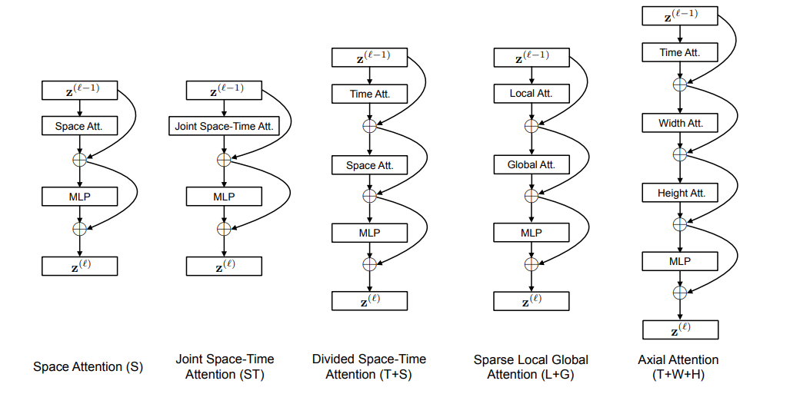

paper|year|conference|keyword|link
-|-|-|-|-
[Is Space-Time Attention All You Need for Video Understanding?](#is-space-time-attention-all-you-need-for-video-understanding)|2021|ICML|Transformer,convolution-free|[paper](https://arxiv.org/pdf/2102.05095.pdf)  [code](https://github.com/facebookresearch/TimeSformer)|
Long-term feature banks for detailed video understanding|2019|CVPR||paper
BiCnet-TKS: Learning Efficient Spatial-Temporal Representation for Video Person Re-Identification|2021|CVPR||paper

****
## Is Space-Time Attention All You Need for Video Understanding?

### Main idea
**Background:**
limitations of convolutional models in video analysis:
1. it has **strong inductive biases**, but transformer has less. It means that transformer will perform better in big training set.
2. convlution model need the deep stacks of convolutions to extend the receptive field to solve the problem of **long-range dependencies**. But self attention can be used to capture capture both local as well as global long-range dependencies

**Method**:They propose the **convolution-free approach**, only use the **self-attention** to construct their model TimeSformer.
1. Extend the **"Vision Transformer" (ViT) from the image space to the space-time 3D volume**. This model views the video as a sequence of patches extracted from the individual frames.
2. Because the number patches in video is large, they design the "divided attention" architecture: **temporal attention and spatial attention**

### Highlight:
1. Five types of self-attention blocks.
Divided space-time attention is the best in this task.

### Idea:
1. Try to design how to use transformer in VSR.
2. Five types of self-attention give the idea to design a new block which is suitable for VSR or other tasks.

## Long-term feature banks for detailed video understanding